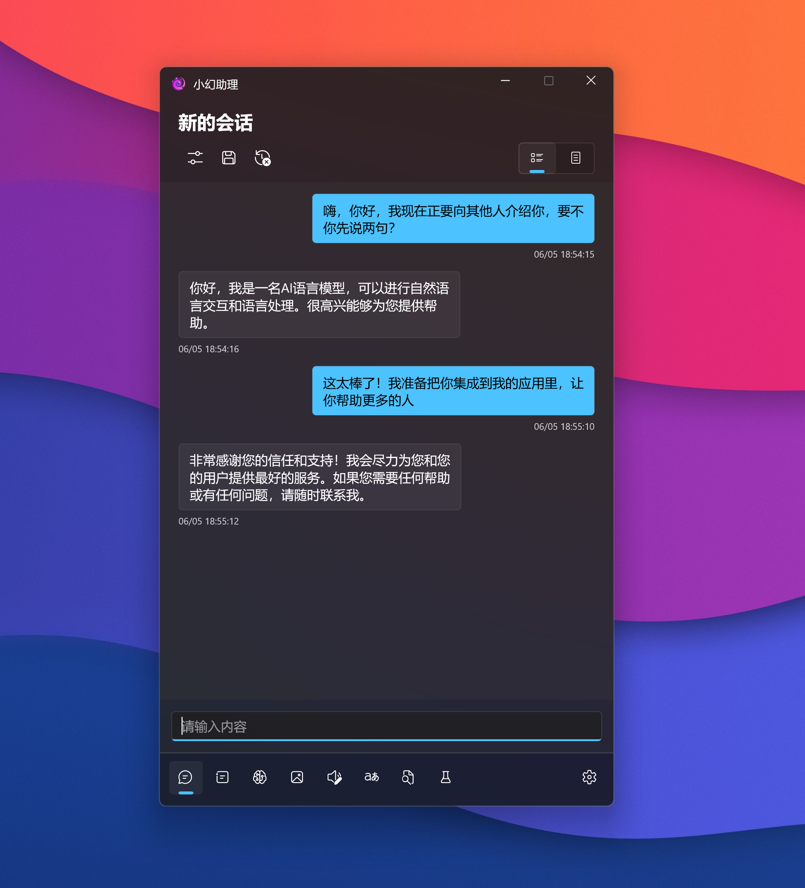

# 小幻助理

    

人与AI相互成就的一次探索

**仓库将会在文档撰写完毕后开源**

---

**小幻助理** 集成了 Open AI 和 Azure 的 AI 服务，致力于构建以大语言模型为核心，具备高延展性的个人助理工具。

## 🙌 简单的开始

### 从商店安装

  <a title="从 Microsoft 获取" href="https://www.microsoft.com/store/apps/9NB0NB3MLQTM?launch=true&mode=full" target="_blank">
    <picture>
      <source srcset="https://get.microsoft.com/images/zh-CN%20light.svg" media="(prefers-color-scheme: dark)" />
      <source srcset="https://get.microsoft.com/images/zh-CN%20dark.svg" media="(prefers-color-scheme: light), (prefers-color-scheme: no-preference)" />
      
    </picture>
  </a>

### 运行环境要求

|          |                             |
| -------- | --------------------------- |
| 系统版本 | Windows 11 ver 22000 及以上 |
| 运行时   | .NET 7                      |

### 服务配置

应用不提供初始的密钥配置，这要求你拥有一些自己的服务及其密钥，这是对应关系：

| 服务                     | 涉及功能                                     |
| ------------------------ | -------------------------------------------- |
| Open AI 或 Azure Open AI | 对话、提示词管理、会话管理、知识库、语义技能 |
| Azure Speech Service     | 文本转语音、语音识别                         |
| Azure Translator         | 文本翻译                                     |
| Everything               | 文件搜索                                     |
| Stable Diffusion         | 文生图                                       |

## ❓ 常见问题

在应用的安装使用过程中，你可能会碰到一些问题，这篇文档也许可以帮助你解决遇到的困难：[常见问题](https://github.com/Richasy/FantasyCopilot/wiki/)

## 📃 文档

所有关于 **小幻助手** 的文档，包括架构、使用说明等，都放在仓库的 [Wiki](https://github.com/Richasy/FantasyCopilot/wiki) 中，如果你发现有文档缺失或错误，请提交 [Issue](https://github.com/Richasy/FantasyCopilot/issues/new/choose) 说明错漏的内容。

## 🔌 插件

> 应用只会按照配置文件执行对应的程序，**不负责验证插件的可靠性**，如果你因为使用未知来源的插件造成了任何损失，**应用不承担任何责任**。

你可以利用应用提供的插件功能极大地扩展应用的边界，理论上你可以使用任何语言编写插件，或者为现有的程序编写配置文件进行集成。

如果你对编写插件感兴趣，可以在 [Wiki](ttps://github.com/Richasy/FantasyCopilot/wiki) 中查看更多。

## 🔒 数据安全

1. 代码全部开源，首选引用开源依赖，开发者承诺不会在上传应用商店的版本中添加额外代码。
2. 不上传隐私数据和日志记录，所有日志保留在本地，未来会视情况进行有限度的应用使用情况数据收集。
3. 使用 `PasswordVault` 保存用户的密钥，UI 上显示密文。
4. 为了解析方便，导出配置时仍会明文显示密钥，所以导入和导出配置时都要求进行 Windows Hello 身份验证（如果设备支持）。

同时，你也需要注意自身的数据安全，尽量避免使用未知来源或闭源的插件，避免将涉密信息、敏感内容、商业机密等数据直接发送给相关服务商。

## 🚀 协作

我们欢迎志同道合的朋友参与 **小幻助理** 项目，在这里分享你的见解与思路。
你可以选择以下内容参与：

| 方向             | 价值                                                           |
| ---------------- | -------------------------------------------------------------- |
| 应用主体程序开发 | 为用户提供稳定可靠的服务基底                                   |
| 核心库开发       | 为用户或其它插件开发者提供足够通用和基础的工具                 |
| 插件开发         | 提供插件给众多用户使用，众人拾柴火焰高                         |
| 经验分享         | 我们诚挚邀请你向其他用户分享你的使用经验，提出你对应用新的期许 |
| 更多             | 我们欢迎任何形式的贡献                                         |

## 🤩 感谢

- [Windows App SDK](https://github.com/microsoft/WindowsAppSDK)
- [Semantic Kernel](https://github.com/microsoft/semantic-kernel)
- [Community Toolkit](https://github.com/CommunityToolkit)
- [azure-sdk-for-net](https://github.com/Azure/azure-sdk-for-net)
- [NLog](https://nlog-project.org/)
- [H.NotifyIcon](https://github.com/HavenDV/H.NotifyIcon)
- [CsvHelper](https://github.com/JoshClose/CsvHelper)
- And other open source contributors.

## 🧩 截图

