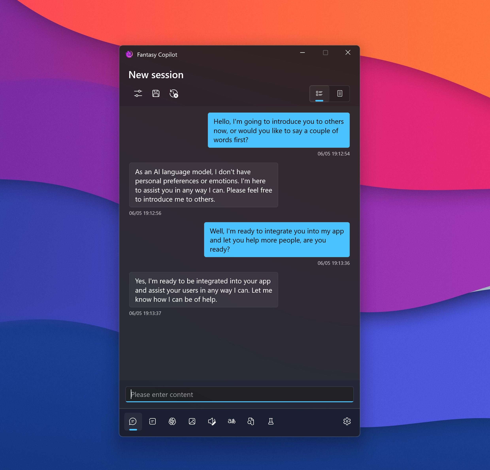

# Fantasy Copilot

    

An exploration of mutual achievement between humans and AI.

---

"Fantasy Copilot" integrates Open AI and Azure's AI services, dedicated to building a personal assistant tool with a large language model as the core and high scalability.

## 🙌 Simple Start

### Install from Microsoft Store

  <a title="Get from Microsoft Store" href="https://www.microsoft.com/store/apps/9NB0NB3MLQTM?launch=true&mode=full" target="_blank">
    <picture>
      <source srcset="https://get.microsoft.com/images/en-US%20light.svg" media="(prefers-color-scheme: dark)" />
      <source srcset="https://get.microsoft.com/images/en-US%20dark.svg" media="(prefers-color-scheme: light), (prefers-color-scheme: no-preference)" />
      
    </picture>
  </a>

### System Requirements

|                  |                               |
| ---------------- | ----------------------------- |
| Operating System | Windows 11 ver 22000 or later |
| Runtime          | .NET 7                        |

### Service Configuration

The application does not provide initial key configuration, which requires you to have your own services and their corresponding keys. Here is the corresponding relationship:

| Service                  | Involved Functionality                                                           |
| ------------------------ | -------------------------------------------------------------------------------- |
| Open AI or Azure Open AI | Chat, prompt management, session management, knowledge base, semantic skills |
| Azure Speech Service     | Text-to-speech, speech recognition                                               |
| Azure Translator / Baidu Translator        | Text translation                                                                 |
| Everything               | File search                                                                      |
| Stable Diffusion         | Text to Image                                           |

## ❓ FAQ

As you use and install the application, you may encounter some issues. This document may help you solve the difficulties you encounter: [FAQ](https://github.com/Richasy/FantasyCopilot/wiki/).

## 📃 Wiki

All documents related to **Fantasy Copilot**, including architecture and usage instructions, are stored in the repository's [Wiki](https://github.com/Richasy/FantasyCopilot/wiki). If you find any missing or incorrect documents, please submit an [Issue](https://github.com/Richasy/FantasyCopilot/issues/new/choose) to explain the errors or omissions.

## 🔌 Plug-in

> The application only executes corresponding programs according to the configuration file and is **not responsible for verifying the reliability of plugins**. If you suffer any losses due to the use of plugins from unknown sources, the application **will not be held responsible**.

You can greatly expand the boundaries of an application by utilizing the plugin functionality provided by the application. In theory, you can use any programming language to write plugins or create configuration files for integration with existing programs.

If you are interested in writing plugins, you can find more information in the [Create Plugins](https://github.com/Richasy/FantasyCopilot/wiki/Create-Plugins).

## 🔒 Data Security

1. All code is open source, and open source dependencies are preferred. Developer promise not to add additional code in the version uploaded to the Microsoft Store.
2. No privacy data or log records will be uploaded, and all logs will be kept locally. Limited application usage data collection may be conducted in the future depending on the situation.
3. Use `PasswordVault` to save user keys, and display ciphertext on the UI.
4. For convenience in parsing, the key will still be displayed in plaintext when exporting the configuration. Therefore, Windows Hello authentication is required for both importing and exporting configurations (if the device supports it).

At the same time, you should also pay attention to your own data security, avoid using plugins from unknown sources or closed sources, and avoid sending confidential information, sensitive content, business secrets, and other data directly to relevant service providers.

## 🚀 Collaboration

We welcome like-minded friends to participate in the **Fantasy Copilot** project and share your insights and ideas here. You can choose to participate in the following areas:

| Direction         | Value                                                         |
| ----------------- | ------------------------------------------------------------- |
| Application development | Provide users with a stable and reliable service foundation |
| Core library development | Provide sufficient general and basic tools for users or other plugin developers |
| Plugin development | Provide plugins for many users to use, and many hands make light work |
| Experience sharing | We sincerely invite you to share your usage experience with other users and put forward your new expectations for the application |
| More | We welcome any form of contribution |

## 🤩 Thanks

- [Windows App SDK](https://github.com/microsoft/WindowsAppSDK)
- [Semantic Kernel](https://github.com/microsoft/semantic-kernel)
- [Community Toolkit](https://github.com/CommunityToolkit)
- [azure-sdk-for-net](https://github.com/Azure/azure-sdk-for-net)
- [NLog](https://nlog-project.org/)
- [H.NotifyIcon](https://github.com/HavenDV/H.NotifyIcon)
- [CsvHelper](https://github.com/JoshClose/CsvHelper)
- [EverythingNet](https://github.com/ju2pom/EverythingNet)
- [Markdig](https://github.com/xoofx/markdig)
- And other open source contributors.

## 🧩 Screenshots

